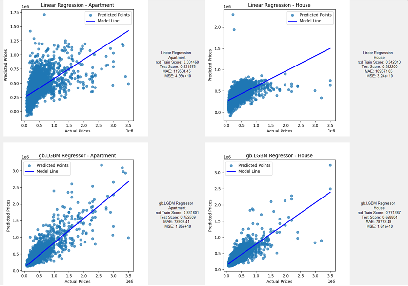

# immo-eliza-ml-Majid 🏢 


##  🏠 Description

This project is focused on predicting real estate prices using machine learning models. It includes preprocessing of the data, feature engineering, training multiple linear regression and random forest models, and evaluating their performance. The project structure is designed to separate the processes into modules for better readability and maintenance.

Make sure to check the models card for clarification on the models.


### Issues and update requests
- If you encounter any issues or have suggestions for improvements, please feel free to open an issue in the repository.
- Contributions to enhance the functionality or performance of the models are always welcome.

Find me on [LinkedIn](https://www.linkedin.com/in/majidaskary) for collaboration, feedback, or to connect.

## 📦 Repo structure
```.
│   ANN.py
│   predict.py
│   README.md
│   train.py
│ 
├───dataset
│       advance_preprocessed_dataset.csv
│       basic_preprocessed_dataset.csv
│       becode_properties.csv
│       
├───info
│       mlenv_virtual_environment_libruaries.txt
│       output.png
│       
├───Notebook
│       preprocessing.ipynb
│       
└───trained_models
        CatBoost_Regresso_Apartment.pkl
        CatBoost_Regresso_House.pkl
        Decision_Tree_Apartment.pkl
        Decision_Tree_House.pkl
        gb.LGBM_Regressor_Apartment.pkl
        gb.LGBM_Regressor_House.pkl
        Gradient_Boosting_Regressor_Apartment.pkl
        Gradient_Boosting_Regressor_House.pkl
        Linear_Regression_Apartment.pkl
        Linear_Regression_House.pkl
        Random_Forest_Regressor_Apartment.pkl
        Random_Forest_Regressor_House.pkl
        XGB_Regressor_Apartment.pkl
        XGB_Regressor_House.pkl
```

## 🚧 Installation 

1. Clone the repository to your local machine.

    ```
    git clone git@github.com:majidaskary/immo-eliza-ml-Majid.git
    ```

2. Navigate to the project directory and install the required dependencies:

    ```
    pip install -r requirements.txt
    ```

## ✔️ Usage 
  
Start by downloading advance_preprocessed_dataset.csv and updating the file path at the beginning of the train.py code.
Then, run train.py to execute the modeling pipeline. You can comment out any model you do not wish to run. The script will process the data from ./data/raw_data.csv, apply preprocessing and feature engineering using preprocessing.ipynb and advance_preprocessed_dataset.csv, then train the models and evaluate their performance.


Example snippet from `train.py`:

```python
class ModelTrainer:
    def __init__(self, dataset_path, apartment_features, house_features,max_price):
        self.dataset_path = dataset_path
        self.dataset = pd.read_csv(dataset_path)
.  
.  
.
```

Results:
The results of the implementation of 7 machine learning models with regression types show that the best result is obtained by the gb.LGBM Regressor algorithm with a score of 0.831801 in the training samples and 0.752509 in the test samples. 

```python
# Output example:
Summary of Model Performances:
                          Model Property Type  Training score  Testing score            MAE           MSE
0             Linear Regression     Apartment        0.331460       0.331875  119534.445774  4.992089e+10
1             Linear Regression         House        0.342013       0.332200  109571.850747  3.239271e+10
2                 Decision Tree     Apartment        0.750463       0.645647   86943.555409  2.647649e+10
3                 Decision Tree         House        0.665164       0.435546   97769.109414  2.737972e+10
4       Random Forest Regressor     Apartment        0.781933       0.703268   81684.373631  2.217116e+10
5       Random Forest Regressor         House        0.706030       0.592407   88813.511892  1.977094e+10
6   Gradient Boosting Regressor     Apartment        0.779352       0.720529   77626.765222  2.088152e+10
7   Gradient Boosting Regressor         House        0.737886       0.645823   80623.068150  1.717991e+10
8                 XGB Regressor     Apartment        0.769694       0.723488   77543.912962  2.066044e+10
9                 XGB Regressor         House        0.722071       0.648980   80516.308557  1.702676e+10
10            gb.LGBM Regressor     Apartment        0.831801       0.752509   73909.409118  1.849203e+10
11            gb.LGBM Regressor         House        0.771387       0.668804   78773.481537  1.606518e+10
12            CatBoost Regresso     Apartment        0.749336       0.718696   80765.796348  2.101844e+10
13            CatBoost Regresso         House        0.682983       0.634674   83316.092535  1.772074e+10


Summary of Model Performances for Apartments (sorted by Testing score):
                         Model Property Type  Training score  Testing score            MAE           MSE
5            gb.LGBM Regressor     Apartment        0.831801       0.752509   73909.409118  1.849203e+10
4                XGB Regressor     Apartment        0.769694       0.723488   77543.912962  2.066044e+10
3  Gradient Boosting Regressor     Apartment        0.779352       0.720529   77626.765222  2.088152e+10
6            CatBoost Regresso     Apartment        0.749336       0.718696   80765.796348  2.101844e+10
2      Random Forest Regressor     Apartment        0.781933       0.703268   81684.373631  2.217116e+10
1                Decision Tree     Apartment        0.750463       0.645647   86943.555409  2.647649e+10
0            Linear Regression     Apartment        0.331460       0.331875  119534.445774  4.992089e+10


Summary of Model Performances for Houses (sorted by Testing score):
                         Model Property Type  Training score  Testing score            MAE           MSE
5            gb.LGBM Regressor         House        0.771387       0.668804   78773.481537  1.606518e+10
4                XGB Regressor         House        0.722071       0.648980   80516.308557  1.702676e+10
3  Gradient Boosting Regressor         House        0.737886       0.645823   80623.068150  1.717991e+10
6            CatBoost Regresso         House        0.682983       0.634674   83316.092535  1.772074e+10
2      Random Forest Regressor         House        0.706030       0.592407   88813.511892  1.977094e+10
1                Decision Tree         House        0.665164       0.435546   97769.109414  2.737972e+10
0            Linear Regression         House        0.342013       0.332200  109571.850747  3.239271e+10
```


Comparison of two models of Linear Regression and gb.LGBM Regressor ventilation with the worst and best scores obtained





## ⏱️ Project Timeline
The initial setup of this project was completed in 5 days.

## 🔧 Updates & Upgrades
### Recent Updates
By implementing more optimal methods for sample data preprocessing and also by having a larger volume of sample data, better results can be achieved in learning models.

### Planned Upgrades
- **Data Pipeline Enhancement**: Improve the automation of data preprocessing and feature selection.
- **Model Experimentation**: Explore additional machine learning models and techniques for accuracy improvement.

## 📌 Personal Note
This project was developed as part of my training into machine learning at [BeCode](https://becode.org/). It serves as a practical application of data preprocessing, feature engineering, and model training and evaluation.

Find me on [LinkedIn](https://www.linkedin.com/in/majidaskary) for collaboration, feedback, or to connect.